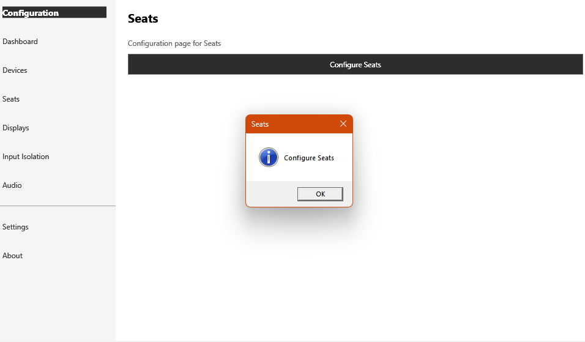

# "Workplaces" Tab

> ASTER reference: https://dokwiki.ibiksoft.com/en/v3/core/gui/gui_controlform_tabcontrol_tabterminals

## What ASTER does

The Workplaces tab is where hardware gets assigned to seats. A **System** area lists PC devices not yet assigned to any workplace and a **Common Devices** area lists devices shared by all or several workplaces; a context menu on these areas opens Windows tools (User Accounts, Display Settings, Network Connections, Device Manager). An **ASTER Settings** section covers workplace-panel behavior, CPU core assignment, keyboard/mouse hotkey switching, experimental settings, license clearing, log filtering, and settings reset. Below that, one **"Place N"** area per configured workplace lists its assigned devices, with a right-click menu to rename it, assign a Windows user, assign an IP address plus associated apps, or restart it.

## OpenMultiSeat status

**🚧 Stub** — placeholder only today. See [Known Issues](../known-issues.md).

This maps to OpenMultiSeat's **Seats** page, which currently shows only a heading, a one-line description, and a single "Configure Seats" button that pops a generic message box — there is no real bound UI yet, even though the backend it needs already exists.

To reach parity with ASTER's Workplaces tab, this page needs:
- An unassigned/common-devices device pool, backed by `IDevicePersistence` and the devices already discovered by `HidDeviceEnumerator` (visible today on the Devices page).
- A per-seat data grid or panel list (one entry per `Seat`) showing that seat's assigned input devices, display(s), and audio device, built from the `Seat`, `InputDevice`, `Display`, and `AudioDevice` Core models.
- Assign/unassign controls (drag-and-drop or pickers) wiring devices, displays (`IDisplayEnumerator` / `DisplayEnumerator`), and audio endpoints into a `SeatConfiguration`.
- Per-seat actions equivalent to ASTER's context menu — rename seat, assign a Windows user (see [User Account for Workstation](user-account-for-workstation.md)), and start/restart the seat's session via `OpenMultiSeat.Sessions`' `SessionManager`.

There is no OpenMultiSeat equivalent of per-workplace IP-address assignment, since OpenMultiSeat currently targets local seats on a single PC rather than networked workplaces.
