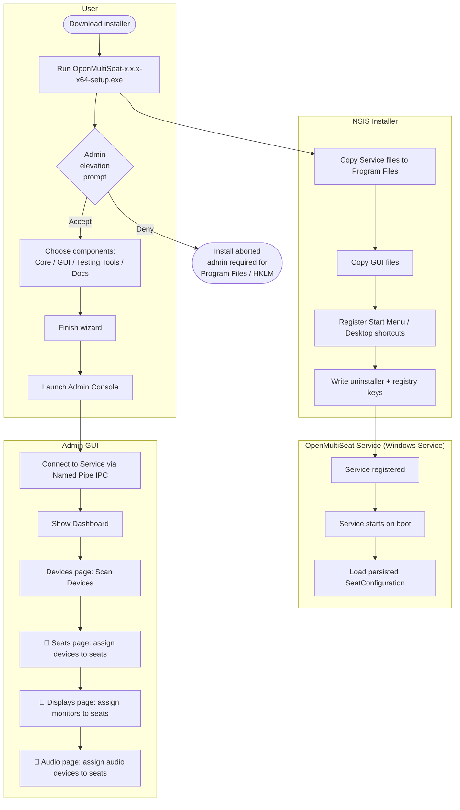
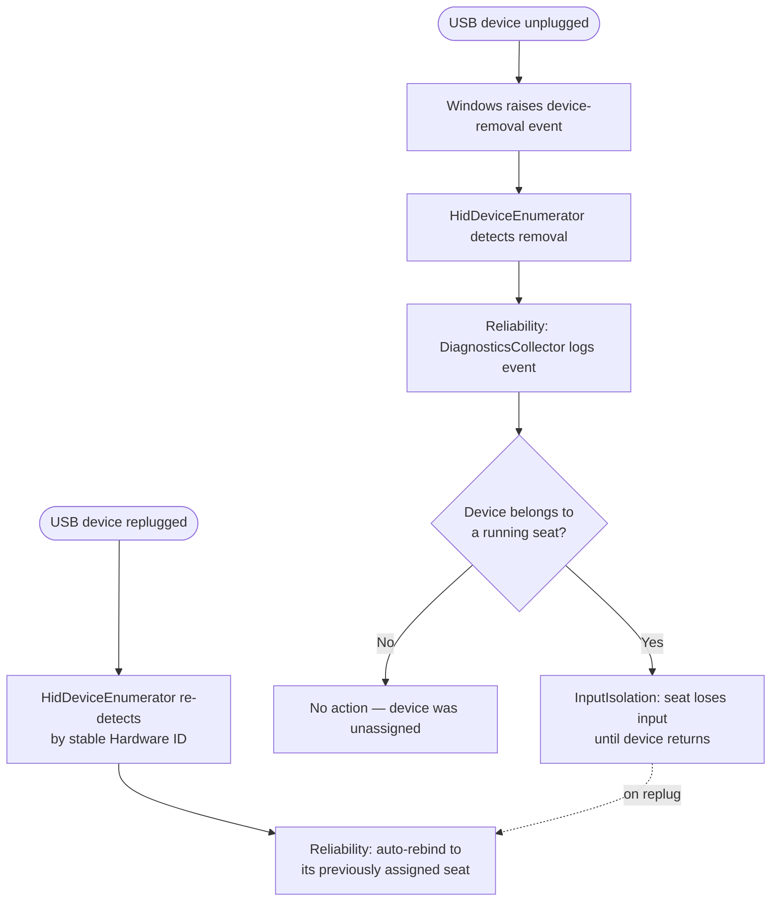

# BPMN Workflows

Business-process view of OpenMultiSeat's end-to-end lifecycle, from install to running multiple independent seats on one PC. Swimlanes separate what the **User**, the **Admin GUI**, and the **Windows Service** each do. Rendered as Mermaid flowcharts (GitHub-flavored Markdown renders these natively); each subgraph is one swimlane.

Unlike ASTER's equivalent workflow, there is **no Activation/License step** — OpenMultiSeat is free and open source, so the process goes straight from install to configuration.

## 1. Install → First Configuration



## 2. Starting Seats (Session Launch)

```mermaid
flowchart TD
    subgraph User["User"]
        A1([Click 'Start Seat' for a<br/>configured seat]) --> A2{🚧 Confirm<br/>Starting of<br/>Workplaces dialog}
    end

    subgraph GUI["Admin GUI"]
        A2 -->|Confirm| B1[Send StartSeat IPC request]
    end

    subgraph Service["Windows Service"]
        B1 --> C1[SessionManager: validate seat config]
        C1 --> C2{Devices/display/<br/>audio all assigned<br/>and free?}
        C2 -->|No| C3[Return validation error]
        C2 -->|Yes| C4[InputIsolation: bind seat's<br/>keyboard/mouse exclusively]
        C4 --> C5[DisplayManager: route seat's<br/>monitor(s) via DisplayEnumerator]
        C5 --> C6[AudioManager: route seat's<br/>audio device]
        C6 --> C7[SessionManager.CreateProcessInSession<br/>via CreateProcessAsUser]
        C7 --> C8[Independent Windows session<br/>running for this seat]
    end

    C3 --> D1[GUI shows error to user]
    C8 --> D2[GUI shows seat as 'Running'<br/>on Dashboard]
```

## 3. Device Reconnect / Reliability (USB unplug-replug)


