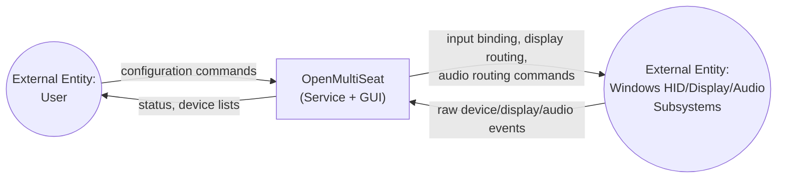
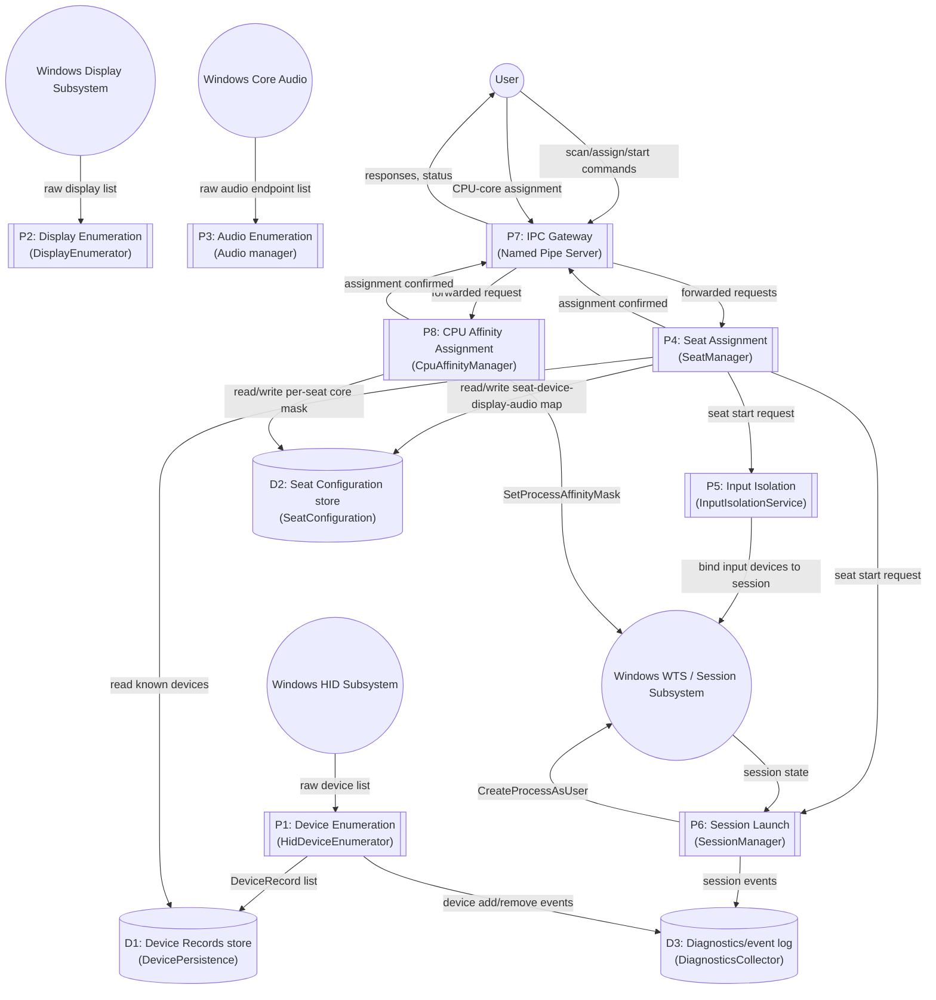

# Data Flow Diagram (DFD)

Mermaid has no native DFD shape set, so this uses flowchart notation with the standard DFD conventions: rounded rectangles = **external entities**, rectangles = **processes**, open-ended bars = **data stores**, arrows = **data flow**.

## Level 0 — Context Diagram

## Level 1 — Service Internal Data Flow

