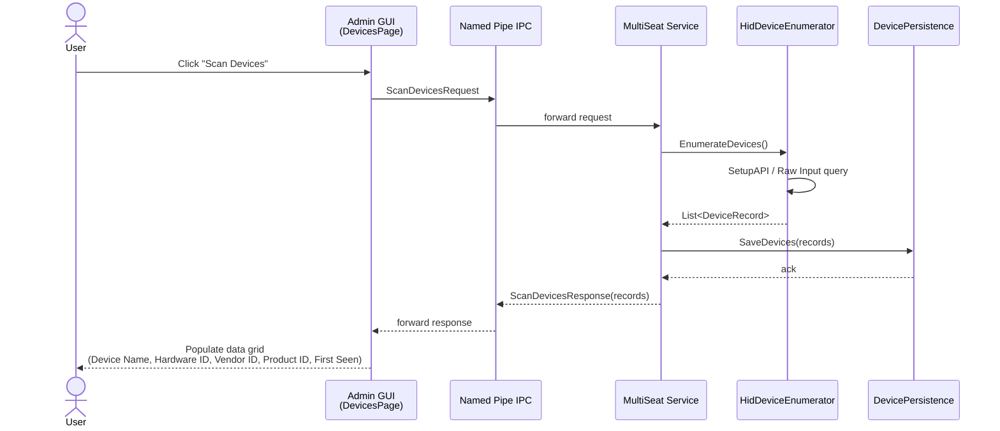
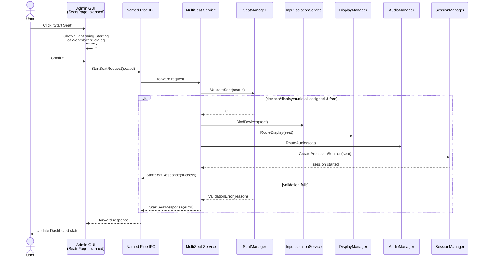
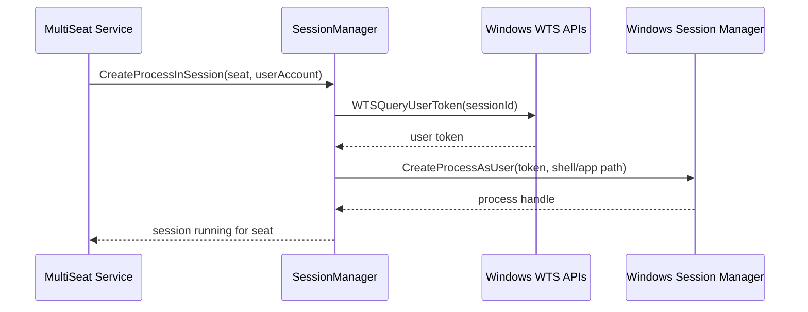

# Sequence Diagrams

Message-level sequences for OpenMultiSeat's three core interactions, all crossing the GUI ↔ Service Named Pipe IPC boundary described in [`../architecture.md`](../architecture.md).

## 1. Device Scan (Devices page — this one is fully implemented today)

## 2. Seat Start (target design — Seats/Displays/Audio pages are stubs today, see known-issues.md)

## 3. Login / Process Launch Detail (`CreateProcessAsUser`)

