# UML Class Diagram

Domain model and manager classes across OpenMultiSeat's projects, extending the component breakdown in [`../architecture.md`](../architecture.md). Interfaces live in `OpenMultiSeat.Core` and implementations live in the feature projects — a deliberate dependency-inversion pattern used to keep `Core` free of references to `Devices`/`Displays`/`Sessions` (this is what fixed the circular project-reference bug the solution originally shipped with).

```mermaid
classDiagram
    namespace Core {
        class Seat {
            +Guid Id
            +string Name
            +List~DeviceRecord~ InputDevices
            +List~Display~ Displays
            +AudioDevice AudioDevice
            +string AssignedUserAccount
        }
        class DeviceRecord {
            +string HardwareId
            +string FriendlyName
            +string VendorId
            +string ProductId
            +DateTime FirstSeen
        }
        class Display {
            +string DeviceName
            +int Width
            +int Height
            +int RefreshRate
        }
        class AudioDevice {
            +string Id
            +string FriendlyName
            +AudioDeviceType Type
            +AudioDeviceRole Role
        }
        class SeatConfiguration {
            +List~Seat~ Seats
            +Load()
            +Save()
        }
        class IDevicePersistence {
            <<interface>>
            +LoadDevices() List~DeviceRecord~
            +SaveDevices(List~DeviceRecord~)
        }
        class IDisplayEnumerator {
            <<interface>>
            +EnumerateDisplays() List~Display~
        }
        class ICpuAffinityProvider {
            <<interface>>
            +int LogicalCoreCount
            +ComputeAffinityMask(List~int~) nint
        }
        class CpuAffinityProvider {
            +int LogicalCoreCount
            +ComputeAffinityMask(List~int~) nint
        }
        class SeatManager {
            +AssignDevice(Seat, DeviceRecord)
            +AssignDisplay(Seat, Display)
            +StartSeat(Seat)
        }
        class DisplayManager {
            -IDisplayEnumerator enumerator
        }
    }

    namespace Devices {
        class HidDeviceEnumerator {
            +EnumerateDevices() List~DeviceRecord~
        }
        class DevicePersistence {
            +LoadDevices() List~DeviceRecord~
            +SaveDevices(List~DeviceRecord~)
        }
    }

    namespace Displays {
        class DisplayEnumerator {
            +EnumerateDisplays() List~Display~
        }
    }

    namespace Sessions {
        class SessionManager {
            +CreateProcessInSession(userToken, seat)
        }
        class SessionEnumerator {
            +EnumerateSessions() List~WtsSessionInfo~
        }
        class ProcessLauncher {
            +CreateProcessInSession(uint, string, string, nint?) uint
        }
    }

    namespace InputIsolation {
        class InputIsolationService {
            +BindDevice(Seat, DeviceRecord)
            +DetermineDeviceType(DeviceRecord) InputDeviceType
        }
    }

    namespace IPC {
        class NamedPipeServer
        class NamedPipeClient
        class IpcMessage {
            +string Command
            +object Payload
        }
    }

    namespace Service {
        class MultiSeatService {
            +OnStart()
            +OnStop()
        }
    }

    namespace GUI {
        class MainWindow
        class DevicesPage
        class SeatsPage
        class DisplaysPage
        class InputPage
        class AudioPage
    }

    DevicePersistence ..|> IDevicePersistence
    DisplayEnumerator ..|> IDisplayEnumerator
    CpuAffinityProvider ..|> ICpuAffinityProvider
    DisplayManager --> IDisplayEnumerator : depends on
    SeatManager --> IDevicePersistence : depends on
    SessionManager --> ICpuAffinityProvider : depends on
    SeatManager --> Seat
    Seat --> DeviceRecord
    Seat --> Display
    Seat --> AudioDevice
    SeatConfiguration --> Seat
    HidDeviceEnumerator --> DeviceRecord : produces
    SessionManager --> ProcessLauncher : passes computed affinity mask
    MultiSeatService --> SeatManager
    MultiSeatService --> SessionManager
    MultiSeatService --> InputIsolationService
    MultiSeatService --> NamedPipeServer
    MainWindow --> NamedPipeClient
    DevicesPage --> MainWindow
    SeatsPage --> MainWindow
    DisplaysPage --> MainWindow
    InputPage --> MainWindow
    AudioPage --> MainWindow
```

**Status note:** `SeatsPage`, `DisplaysPage`, `InputPage`, and `AudioPage` are shown here as they *should* be wired (bound to their respective managers over IPC) — today they are stub views with no such binding. `DevicesPage` looks more complete (a real `DataGrid` with the right columns) but is in the same boat: nothing populates it. See [Known Issues](../known-issues.md). `ICpuAffinityProvider`/`CpuAffinityProvider` are the exception — CPU-core isolation, the fifth axis alongside device/display/audio/input, is implemented (see [Assign CPU Cores](../control-panel/assign-cpu-cores.md)), though its GUI reads/writes seat data directly via `ISeatPersistence` rather than through `NamedPipeServer`/`NamedPipeClient`, since no page has that IPC wiring yet.
