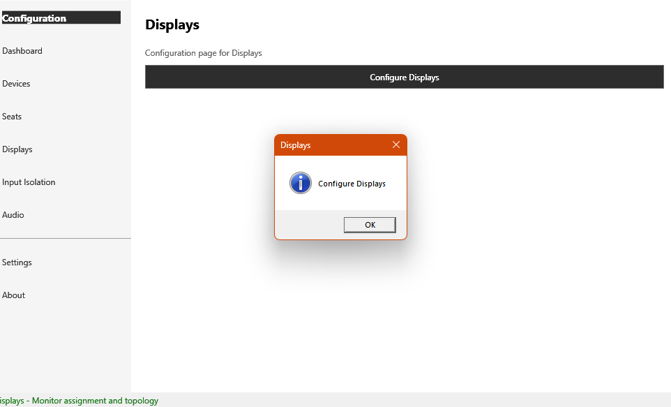
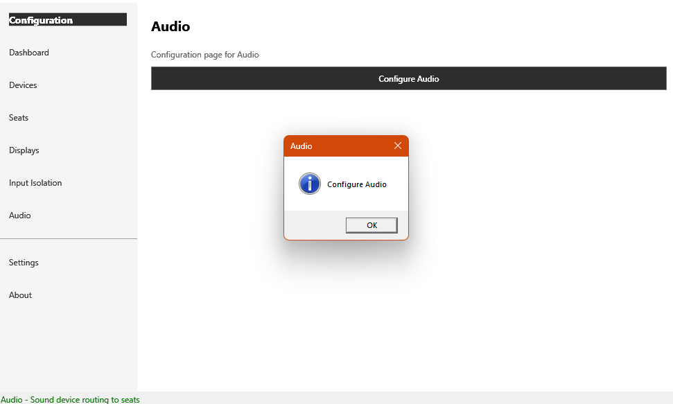

# Known Issues

## GUI: Displays, Input Isolation, and Audio pages are non-functional stubs

**Status:** open, tracked here. Devices, Seats, and Assign CPU Cores have since been wired to real backends (see below) — Displays, Input Isolation, and Audio have not.

**Found by:** launching the built `OpenMultiSeat.GUI.exe` and screenshotting each nav page. Devices, Seats, and Assign CPU Cores were fixed in follow-up work; see their own status rows below rather than the original screenshots, which now describe a stale state for those three.

### What's actually there today

The three remaining pages each render as: a page title, a one-line static description, and a single button whose *only* behavior is to pop a generic `MessageBox.Show("Configure <X>")` info dialog — the box literally repeats the button's own label back at the user and does nothing else. There is no data grid, no form, no binding to the backend managers that already exist for each of these areas (`DisplayManager`/`DisplayEnumerator`, `InputIsolationService`, the audio manager in `OpenMultiSeat.Audio`).

Compare this to **Devices**, **Seats**, and **Assign CPU Cores**, which are genuinely wired up: Devices has a real `DataGrid` (Device Name, Hardware ID, Vendor ID, Product ID, Assigned To, First Seen columns) bound to `HidDeviceEnumerator`/`DevicePersistence` with working Scan/Refresh/Export Report/Assign to Seat/Unassign buttons; Seats has a real seat list with working Create/Delete, bound to `SeatManager`/`SeatPersistence`; Assign CPU Cores (reachable from the Settings page) reads and writes real `Seat.CpuCoreAffinity` data via `ISeatPersistence`.

| Page | Real backend exists? | GUI wired to it? |
|---|---|---|
| Devices | ✅ `OpenMultiSeat.Devices` | ✅ Yes |
| Seats (list/create/delete) | ✅ `OpenMultiSeat.Core.SeatManager` | ✅ Yes |
| Assign CPU Cores | ✅ `OpenMultiSeat.Core.CpuAffinityProvider` | ✅ Yes |
| Devices → Seat assignment (keyboard/mouse) | ✅ `SeatManager.AssignDeviceToSeatAsync` | ✅ Yes — "Assign to Seat…"/"Unassign" on the Devices page |
| Seats → display/audio assignment | ✅ backend managers exist | ❌ Stub only — no UI to assign a display or audio endpoint to a seat yet |
| Displays | ✅ `OpenMultiSeat.Displays` | ❌ Stub only |
| Input Isolation | ✅ `OpenMultiSeat.InputIsolation` | ❌ Stub only |
| Audio | ✅ `OpenMultiSeat.Audio` | ❌ Stub only |

Fixed alongside this: `SeatManager`'s in-memory "already assigned elsewhere" guard (`_deviceToSeatMap`) was never rebuilt from persisted seat data — only populated by assignment calls made within the same `SeatManager` instance's own lifetime. Since the GUI constructs a fresh `SeatManager` per page load, this silently defeated the exclusivity check entirely; a device could be assigned to two seats at once with no error. `GetAllSeatsAsync` now rebuilds the map from each seat's `KeyboardIds`/`MouseIds` on every load, covered by `tests/OpenMultiSeat.Tests/SeatManagerTests.cs`.

**Caveat for the three "wired" pages, same as before:** they talk to `ISeatPersistence`/`IDevicePersistence` directly, not over `OpenMultiSeat.IPC` — there is still no GUI page with real IPC wiring to the Service.

Screenshots of the three still-broken pages (still accurate — nothing changed on these):

| Displays | Input Isolation | Audio |
|---|---|---|
|  |  |  |

The original Devices/Seats screenshots (`images/screenshots/devices-page-1.png`, `devices-page-2.png`, `seats-page-stub.png`) are kept in the repo for history but no longer embedded here — they show a state that's since been fixed.

### Where the code lives

- `src/OpenMultiSeat.GUI/Pages/SeatsPage.xaml(.cs)` — ✅ list/create/delete now real; device/display/audio assignment still missing
- `src/OpenMultiSeat.GUI/Windows/AssignCpuCoresWindow.xaml(.cs)` — ✅ real
- `src/OpenMultiSeat.GUI/Pages/DisplaysPage.xaml(.cs)`
- `src/OpenMultiSeat.GUI/Pages/InputPage.xaml(.cs)`
- `src/OpenMultiSeat.GUI/Pages/AudioPage.xaml(.cs)`

### What each remaining page needs to become real (summary — see the matching [control-panel](control-panel/README.md) pages for the ASTER-equivalent UX each should aim for)

- **Seats page — display/audio assignment** — device assignment is done (see above); the remaining piece is display and audio endpoint assignment, equivalent to ASTER's [Assigning Video Outputs](control-panel/assigning-video-outputs.md) window and the audio-routing portion of its device/workplace assignment flow.
- **Reassignment ("move" a device between seats)** — today, moving an already-assigned device to a different seat means unassigning it first, then assigning it again; there's no single-step move or the before/after confirmation table ASTER's [Confirm Device Destination](control-panel/confirm-device-destination.md) window provides.
- **Displays page** — a display list (from `DisplayEnumerator.EnumerateDisplays()`) with a seat-assignment dropdown per monitor, equivalent to ASTER's [Assigning Video Outputs](control-panel/assigning-video-outputs.md) window.
- **Input Isolation page** — a device list with per-seat binding, equivalent to ASTER's [Input Devices Switch](control-panel/input-devices-switch.md) window, bound to `InputIsolationService`.
- **Audio page** — a per-seat audio endpoint picker, bound to `OpenMultiSeat.Audio`'s enumerator (no direct ASTER equivalent window found in the wiki structure the docs are modeled on; ASTER handles this within its device/workplace assignment flow).
