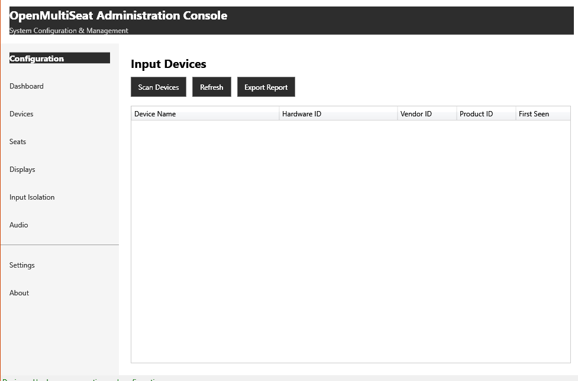

# Known Issues

## GUI: Seats, Displays, Input Isolation, and Audio pages are non-functional stubs

**Status:** open, tracked here. Not fixed as part of the ASTER-parity documentation pass — this is a separate GUI feature-development effort.

**Found by:** launching the built `OpenMultiSeat.GUI.exe` and screenshotting each nav page.

### What's actually there today

Each of these four pages currently renders as: a page title, a one-line static description, and a single button whose *only* behavior is to pop a generic `MessageBox.Show("Configure <X>")` info dialog — the box literally repeats the button's own label back at the user and does nothing else. There is no data grid, no form, no binding to the backend managers that already exist for each of these areas (`SeatManager`, `DisplayManager`/`DisplayEnumerator`, `InputIsolationService`, the audio manager in `OpenMultiSeat.Audio`).

Compare this to the **Devices** page, which is fully implemented: a real `DataGrid` (Device Name, Hardware ID, Vendor ID, Product ID, First Seen columns) wired to `HidDeviceEnumerator`/`DevicePersistence`, with working Scan/Refresh/Export Report buttons.

| Page | Screenshot | Real backend exists? | GUI wired to it? |
|---|---|---|---|
| Devices |  | ✅ `OpenMultiSeat.Devices` | ✅ Yes |
| Seats |  | ✅ `OpenMultiSeat.Core.SeatManager` | ❌ Stub only |
| Displays |  | ✅ `OpenMultiSeat.Displays` | ❌ Stub only |
| Input Isolation |  | ✅ `OpenMultiSeat.InputIsolation` | ❌ Stub only |
| Audio |  | ✅ `OpenMultiSeat.Audio` | ❌ Stub only |

### Where the code lives

- `src/OpenMultiSeat.GUI/Pages/SeatsPage.xaml(.cs)`
- `src/OpenMultiSeat.GUI/Pages/DisplaysPage.xaml(.cs)`
- `src/OpenMultiSeat.GUI/Pages/InputPage.xaml(.cs)`
- `src/OpenMultiSeat.GUI/Pages/AudioPage.xaml(.cs)`

### What each page needs to become real (summary — see the matching [control-panel](control-panel/README.md) pages for the ASTER-equivalent UX each should aim for)

- **Seats page** — a seat list/grid, "Add Seat"/"Remove Seat", and per-seat device/display/audio assignment (equivalent to ASTER's [Devices to Workplace(s) Assignment](control-panel/devices-to-workplace-assignment.md), [Workplace Tab Settings](control-panel/workplace-tab-settings.md), and [Confirm Device Destination](control-panel/confirm-device-destination.md) windows combined) — bound to `SeatManager` and `SeatConfiguration` over the existing IPC channel.
- **Displays page** — a display list (from `DisplayEnumerator.EnumerateDisplays()`) with a seat-assignment dropdown per monitor, equivalent to ASTER's [Assigning Video Outputs](control-panel/assigning-video-outputs.md) window.
- **Input Isolation page** — a device list with per-seat binding, equivalent to ASTER's [Input Devices Switch](control-panel/input-devices-switch.md) window, bound to `InputIsolationService`.
- **Audio page** — a per-seat audio endpoint picker, bound to `OpenMultiSeat.Audio`'s enumerator (no direct ASTER equivalent window found in the wiki structure the docs are modeled on; ASTER handles this within its device/workplace assignment flow).

This is intentionally scoped as documentation only in this pass. Implementing the four pages is real GUI + IPC-plumbing work and should be planned as its own task.
